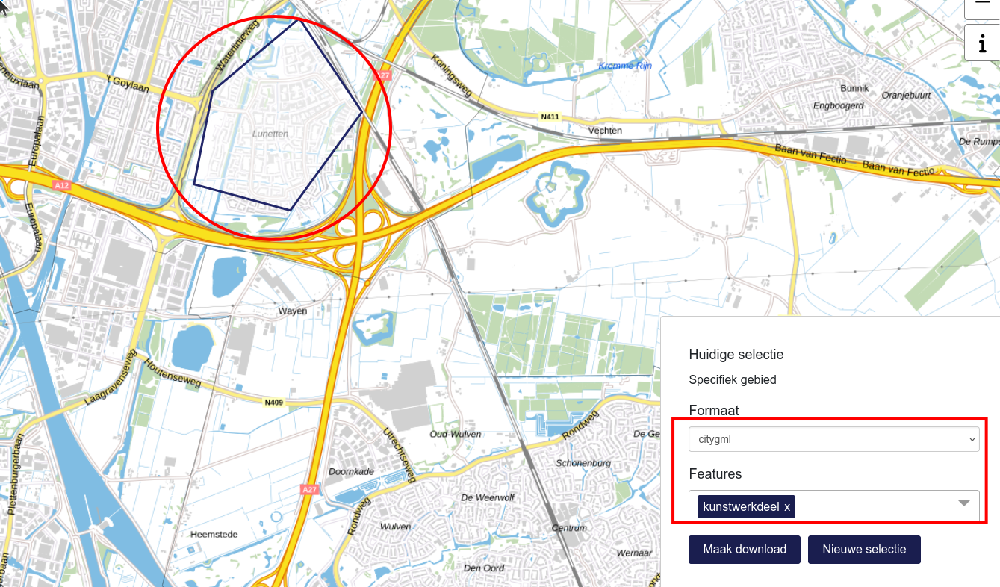

# Deel 2: GML (BGT) importeren

## Inleiding
Een shapefile in een geopackage importeren gaat meestal vrij eenvoudig. Dit komt vooral door de beperkingen van dit formaat: zo bevat een shapefile altijd alleen punten, lijnen óf vlakken. Heel anders is het met bijvoorbeeld GML: daar kan van alles in zitten, en niet alleen geodata. In dit deel leer je aan de hand van een stukje Basisregistratie Grootschalige Topografie (BGT) hoe je zoiets ook met ogr2ogr in goede banen kan leiden.

## BGT downloaden
We gaan eerst een klein stukje uit de BGT downloaden, om dat vervolgens te gaan importeren in een geopackage. Bijvoorbeeld: de kunstwerkdelen, die zijn vaak wel lekker moeilijk. 

Ga naar de [Downloadpagina BGT](https://app.pdok.nl/lv/bgt/download-viewer/) en zoom in op een favoriet stukje Nederland. Trek een vlak rondom het gebied dat je wil downloaden. Niet al te groot, bijvoorbeeld ongeveer één wijk in je favoriete woonplaats. Kies voor download het formaat citygml en zorg ervoor dat in ieder geval kunstwerkdeel erbij zit. 

Pak de kunstwerkdelen uit de gedownloade zip en zet die op een handige plek weg. Zoals je ziet is dit een GML bestand. 

## Importeren en bekijken
Importeer de gedownloade kunstwerkdelen in een geopackage; dat mag een nieuwe geopackage zijn, maar je mag ook degene gebruiken die je in deel 1 hebt gemaakt, en daarin de nieuwe lagen toevoegen. Hou rekening met de volgende dingen:

* geef de nieuwe laag een duidelijke naam (`-nln` argument)
* bedenk hoe dat ook alweer zit met het `-overwrite` argument: moet je dat gebruiken of niet?

Bekijk in QGIS (kaartscherm / Browser) hoe e.e.a. eruit ziet. Alles helemaal oké? Nou , niet helemaal ...

