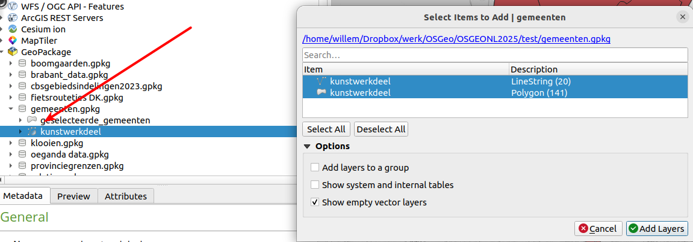

# Deel 2: GML (BGT) importeren

## Inleiding
Een shapefile in een geopackage importeren gaat meestal vrij eenvoudig. Dit komt vooral door de beperkingen van dit formaat: zo bevat een shapefile altijd alleen punten, lijnen óf vlakken. Heel anders is het met bijvoorbeeld GML: daar kan van alles in zitten, en niet alleen geodata. In dit deel leer je aan de hand van een stukje Basisregistratie Grootschalige Topografie (BGT) hoe je zoiets ook met ogr2ogr in goede banen kan leiden.

## BGT downloaden
We gaan eerst een klein stukje uit de BGT downloaden, om dat vervolgens te gaan importeren in een geopackage. Bijvoorbeeld: de kunstwerkdelen, die zijn vaak wel lekker weerbarstig. 

Ga naar de [Downloadpagina BGT](https://app.pdok.nl/lv/bgt/download-viewer/) en zoom in op een favoriet stukje Nederland. Trek een vlak rondom het gebied dat je wil downloaden. Niet al te groot, bijvoorbeeld ongeveer één wijk in je favoriete woonplaats. Kies voor download het formaat citygml en zorg ervoor dat in ieder geval kunstwerkdeel erbij zit. 

Pak de kunstwerkdelen uit de gedownloade zip en zet die op een handige plek weg. Zoals je ziet is dit een GML bestand. 

## Importeren en bekijken
Importeer de gedownloade kunstwerkdelen in een geopackage; dat mag een nieuwe geopackage zijn, maar je mag ook degene gebruiken die je in deel 1 hebt gemaakt, en daarin de nieuwe lagen toevoegen. Hou rekening met de volgende dingen:

* geef de nieuwe laag een duidelijke naam (`-nln` argument)
* bedenk hoe dat ook alweer zit met het `-overwrite` argument: moet je dat gebruiken of niet?

Bekijk in QGIS (kaartscherm / Browser) hoe e.e.a. eruit ziet. Alles helemaal oké? Nou , niet helemaal ...

Er vallen twee dingen op:

* In de QGIS Browser zie je aan het icoontje dat de geometrie niet duidelijk gedefinieerd is: punt, lijn en vlak bij elkaar?
* Als je de laag in het kaartscherm in QGIS toevoegt krijg je eerst een dialoogscherm. Er zijn (althans in dit voorbeeld) 2 lagen: één met lijnen en één met vlakken.
* Overigens hangt het af van welk gebied je hebt geïmporteerd: je kan ook nog een laag met punten hebben, of juist geen lijnen. 

In principe kán dit wel, maar een geodata beheerder wordt hier niet echt blij van. Als je de data echt een beetje netjes wil organiseren maak je daar aparte lagen (tabellen) van: ééntje met vlakken en ééntje met lijnen, en eventueel ook nog een met punten als die er zijn. 

## Alleen vlakken importeren
Laten we ons even beperken tot de vlakken, en alleen deze in de geopackage importeren. Het resultaat zouden we dan bijvoorbeeld _kunstwerkdeel_vlak_ kunnen noemen. Met ogr2ogr kunnen we dat doen door de BGT objecten te filteren met een `-where` argument: 

`-where "OGR_GEOMETRY ILIKE '%polygon%'"`

Als we dit als argument aan onze commandoregel toevoegen zorgen we ervoor dat alleen de objecten met een vlakgeometrie worden geïmporteerd. Stel het commando samen, zorg er meteen voor dat de tabel _kunstwerkdeel_vlak heet_, en voer het uit (mocht er een foutmelding over 'multipolygon' o.i.d. komen, kijk dan even bij [Troubleshooting](#Troubleshooting). Bekijk het resultaat opnieuw in de Browser en het QGIS kaartscherm. Als het goed (?) is, zie je dat het toch nog niet helemaal oké is. Er is blijkbaar nog steeds geen goed gedefinieerde geometrie, en dus krijg je weer een dialoogscherm als je het resultaat in de kaart wil zien. De selectie is zo te zien wél goed gegaan: het dialoogscherm laat alleen een laag met vlakken zien.

Maar, we hebben dus nog een extra argument nodig om het écht goed te doen. Hiervoor hebben we `-nlt` (new layer type), waarmee we het geometrietype van de nieuwe laag vastleggen. Dat moeten vlakken (POLYGON) zijn, dus je moet de commandoregel hiermee uitbreiden:

`-nlt POLYGON`

Probeer dit eens uit, en check het resultaat opnieuw. Is het nu wel goed? 

## Troubleshooting: multivlakken?
Het kan zomaar voorkomen dat een invoerdataset een mengeling is van enkelvoudige en meervoudige (multi-) geometrieën. In het geval van vlakken: POLYGON en MULTIPOLYGON. Voor conversietools kan dat problemen opleveren, en dus ook voor ogr2ogr. Maar gelukkig zijn er ook oplossingen! Bijvoorbeeld het paardenmiddel: overal multigeometrieën van maken. Een multivlak dat maar uit één vlak bestaat is immers volkomen valide in de open standaarden. 

Mocht je bij één van de commando's hierboven een foutmelding hebben gekregen die daar een beetje naar riekt, of wil je het gewoon sowieso uitproberen, importeer dan de kunstwerkdeel-vlakken als multivlak in de geopackage:

`ogr2ogr "GPKG" resultaten.gpkg kunstwerkdeel.gml -overwrite -nln geefdietabeleenleukenaam -where "OGR_GEOMETRY ILIKE '%polygon%'" -nlt MULTIPOLYGON -nlt PROMOTE_TO_MULTI`

Missie geslaagd?

[Deel 3: webservices importeren](3_Webservices_importeren.md)
