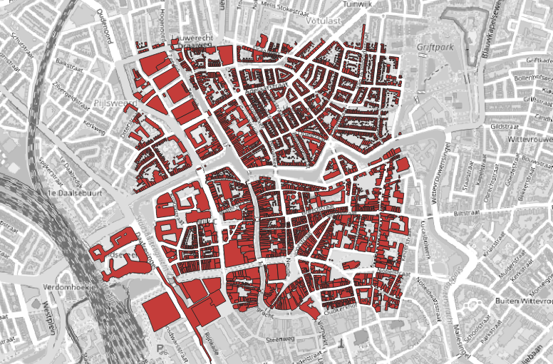

# Deel 3: Webservices importeren

## Intro
Datasets vanaf je eigen harde schijf in een geopackage of andere database importeren met ogr2ogr is handig, maar er is veel meer. Bijvoorbeeld direct data ophalen vanuit een webservice (WFS, OGC-API of ArcGIS REST) via één commandoregel. Om dat dan bijvoorbeeld in een script te stoppen dat deze dataset elke dag actualiseert. 

In dit deel van de workshop gaan we uitvinden hoe dat werkt. We houden het bij het ophalen van data uit een paar relatief betrouwbare en niet al te moeilijke WFS services, daar komt al aardig wat bij kijken. Ga je snel en voel je je uitgedaagd, probeer gerust andere opties en services uit. Wil het niet zo lukken, shop dan in de [documentatie](https://gdal.org/en/stable/programs/ogr2ogr.html) of er extra argumenten zijn waarmee je een en ander naar je hand te zetten.

Een paar tips vooraf:

* We gaan data over het web naar ons toe trekken. Wees ervan bewust dat dit traag kan gaan. Mocht het echt eindeloos duren, gebruik dan b.v. `CTRL-c` om het proces te stoppen.
* Mocht er wat fout gaan, of wil je meer inzicht 'onder de motorkap' tijden een proces (bijvoorbeeld hoe ver ie al is bij het binnenhalen), voeg dan het argument `--debug on` aan je commandoregel toe.

## Gemeentegrenzen 
Laten we beginnen met het naar binnen hengelen van de gemeentegrenzen van het kadaster. De URL van de service is: `https://service.pdok.nl/kadaster/bestuurlijkegebieden/wfs/v1_0?`
Het ogr2ogr commando wordt dan zoiets:

`ogr2ogr "D:\data\test\resultaten.gpkg" WFS:"https://service.pdok.nl/kadaster/bestuurlijkegebieden/wfs/v1_0?" -overwrite -nln gemeenten_kadaster`

Het bekende recept: bekijk in QGIS of e.e.a. helemaal oké is. Vermoedelijk komen er wat typische problemen die we in [Deel 2](2_GML_Importeren.md) ook al zagen, zoals ongedefinieerde geometrie; probeer dit op te lossen door het commando aan te passen.

## BAG panden: BBOX
Als het met de gemeentegrenzen goed is gegaan, kunnen we ook wel wat panden uit de BAG gaan binnenhalen. Maar, uiteraard niet alle 10 miljoen panden van heel Nederland! Dat gaat gegarandeerd niet goed ...

Eén van de opties die je bij een WFS service kan gebruiken is de `BBOX. Hiermee haal je uit een grote dataset alleen de objecten binnen die binnen een bepaalde rechthoek (Bounding Box) vallen, en daarmee kun je het aantal objecten drastisch beperken. De BBOX optie moet in de WFS-string worden ingebakken en komt direct ná de URL en het vraagteken, je krijgt dus zoiets:

`ogr2ogr /home/willem/test/resultaten.gpkg WFS:"https://service.pdok.nl/lv/bag/wfs/v2_0?bbox=136000,456000,137000,457000" -overwrite -nln pand -nlt polygon`

Daarmee haal je binnen een vlak van 1 x 1 kilometer alle panden uit de BAG op. Toch? 

De BAG service heeft, zoals de meeste WFS services, meerdere lagen. Het kán zijn dat we inderdaad netjes de panden hebben binnengehaald, maar het kunnen ook zomaar de woonplaatsen of ligplaatsen zijn, want die zitten er ook in. Kijk maar eens in het [Capabilities document](https://service.pdok.nl/lv/bag/wfs/v2_0?request=GetCapabilities) dat bij de service hoort. Als je daar een beetje in graaft zie je welke lagen er allemaal geserveerd worden. 

We moeten dus specifieker zijn: aangevan dat we de _panden_ uit de service willen halen. Dat kan door de laagnaam achter de URL (en eventueel de BBOX) toe te voegen in het commando:

`ogr2ogr /home/willem/test/resultaten.gpkg WFS:"https://service.pdok.nl/lv/bag/wfs/v2_0?bbox=136000,456000,137000,457000" pand -overwrite -nln pand -nlt polygon`

Als het goed is zie je een mooi blokje van een paar duizend panden in het centrum van Utrecht:

## BAG panden: filter
Een andere manier om een beperkte dataset uit een service binnen te halen is een SQL-filter. Je kan zo'n filter niet alleen gebruiken om de hoeveelheid objecten te beperken, maar bijvoorbeeld ook om alleen bepaalde attributen mee te laten komen in plaats van simpelweg álle attributen. Zelfs ruimtelijke selecties (binnen één en dezelfde service) zijn mogelijk, mits de service dat zelf faciliteert. 

Er is echter een grote 'maar', en dat is dat je, zo gauw je een SQL-filter gebruikt, je niet tegelijkertijd ook de BBOX optie kan gebruiken. Het is dus óf óf. 

Laten we eens proberen de historische panden binnen te halen: alleen die met een bouwjaar vóór 1400. 
Probeer uit één van de vorige commandoregels een nieuwe regel samen te stellen. Als extra argument hebben we nu '-sql' nodig: `-sql "SELECT * FROM pand WHERE bouwjaar < 1400"`

Als dit gelukt is zie je alle panden van vóór 1400 over heel Nederland, zelfs een pand uit het jaar 20 in Den Dungen. Stel dat je tóch ook een ruimtelijke beperking wil, dan zijn er nog 2 mogelijkheden:

* een ruimtelijk filter binnen de webservice toepassen
* het filter inhoudelijk aanscherpen

Zoals we al hadden gezien bevat de BAG webservice ook woonplaatsen. In principe kun je met een SQL-filter in ogr2ogr ook een ruimtelijk filter toepassen. Da's mooi, want dan zouden we bijvoorbeeld de historische panden in één woonplaats kunnen binnenhalen. Zo'n SQL expressie wordt dan uiteraard wel wat gecompliceerder, bijvoorbeeld voor het binnenhalen van alle panden van vóór 1600 in Utrecht:

`-sql "SELECT pand.* FROM pand JOIN woonplaats ON ST_Within(pand.geom, woonplaats.geom) WHERE pand.bouwjaar < 1600 AND woonplaats.woonplaats = 'Utrecht'"`

Kijk eens of het met dit filter lukt. 

* Dit zal wel lukken
* Combi met woonplaatsen: ruimtelijke join met één woonplaats. Foutmeldingen. Capabilities document.
* oude panden in één gemeente: identificatie like ´'
* ODR opendata: wél een ruimtelijke query
