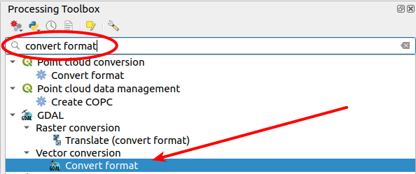
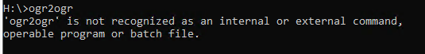
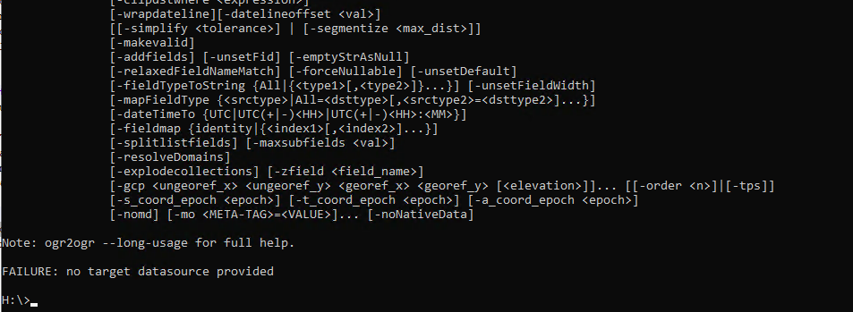

# Inleiding

In deze workshop leer je hoe je met de opensourcetool **ogr2ogr** (geo)data naar je toe kan halen, filteren, converteren en manipuleren.

We beginnen eenvoudig, en naar mate de workhop vordert gaan we snel meer de diepte in.

De workshop bestaat uit drie delen:

  * Een 'simpele' dataset rechttoe rechtaan converteren.
  * Iets lastiger: de BGT converteren.
  * Geavanceerd: data uit een webservice (WFS) ophalen.

## Uitgangspunten

We werken in principe in een geopackage. Dit is een eenvoudige database die je 'on the fly' aan kan maken, en waarin je meerdere datasets kwijt kan. Een geopackage bestaat (in tegenstelling tot een 'echte' database) uit één file die je zonder pardon kan hernoemen of verwijderen als je dat nodig vindt.

Mocht je de beschikking hebben over (bijvoorbeeld) een PostGIS database en daar liever in werken? Geen probleem, de tools die in deze workshop worden behandeld werken op exact dezelfde manier in PostGIS: [hier](./ogr2ogr_postgis.md) een stukje uitleg wat je eraan moet veranderen. Uiteraard heb je wel schrijfrechten in de database nodig!

We gaan er bij de workshop vanuit dat je een laptop hebt waar ogr2ogr op geïnstalleerd staat. Heb je QGIS, dan heb je ook ogr2ogr. Zie [Activeren ogr2ogr](#activeren)

**ogr2ogr** is een _commandline_ tool, en het verdient dan ook de voorkeur om 'm via de commandline (Windows: cmd) te gebruiken. De _Processing Toolbox_ van **QGIS** biedt 'm echter ook aan, zie hieronder. 

Als je de tool _GDAL / Convert format_ krijg je een dialoogscherm waarmee je ogr2ogr kan gebruiken. Zo'n scherm is an sich wat gebruikersvriendelijker dan de commandline. Gedurende de workshop zullen we er echter achter komen dat deze benadering wel de nodige beperkingen heeft. En je zal uiteindelijk toch extra parameters (_Advanced_) moeten invullen als de acties wat minder rechttoe rechtaan worden. Geen aanrader dus, maar voel je vrij om het te proberen!

## Activeren ogr2ogr

Open, om ogr2ogr te gebruiken, een commandline window op je laptop. In Windows: open het programma _cmd_, bij Linux / Mac heb je de _Terminal_ (sneltoets: `CTRL-ALT-t`). 
Check vervolgens of je ogr2ogr aan de praat krijgt door in te tikken:

`ogr2ogr`

Veel kans (met name bij Windows) dat je een melding krijgt dat het commando niet gevonden is:

In dat geval is er nog wat werk aan de winkel. Zet het path naar QGIS (waar ogr2ogr in zit) in de omgevingsvariabelen. Zoek in de verkenner op waar QGIS geïnstalleerd staat. 

Voorbeeld: _C:\Program Files\QGIS 3.40\bin_

Laten we dat dan direct via de commandline goed zetten:

`set PATH=%PATH%;"C:\Program Files\QGIS 3.40\bin"`

**N.B.** Let op de dubbele quotes in het commando: als er spaties in het pad staan (b.v. Program Files) is dit een must!
Check nu nog een keer door in te tikken:

`ogr2ogr`

Je krijgt nu een stuk code terug, die eindigt met een FAILURE melding:

Dat is goed nieuws: ogr2ogr werkt! Het feest kan beginnen ...

[Deel 1: shape importeren](./1_shape_importeren.md)
